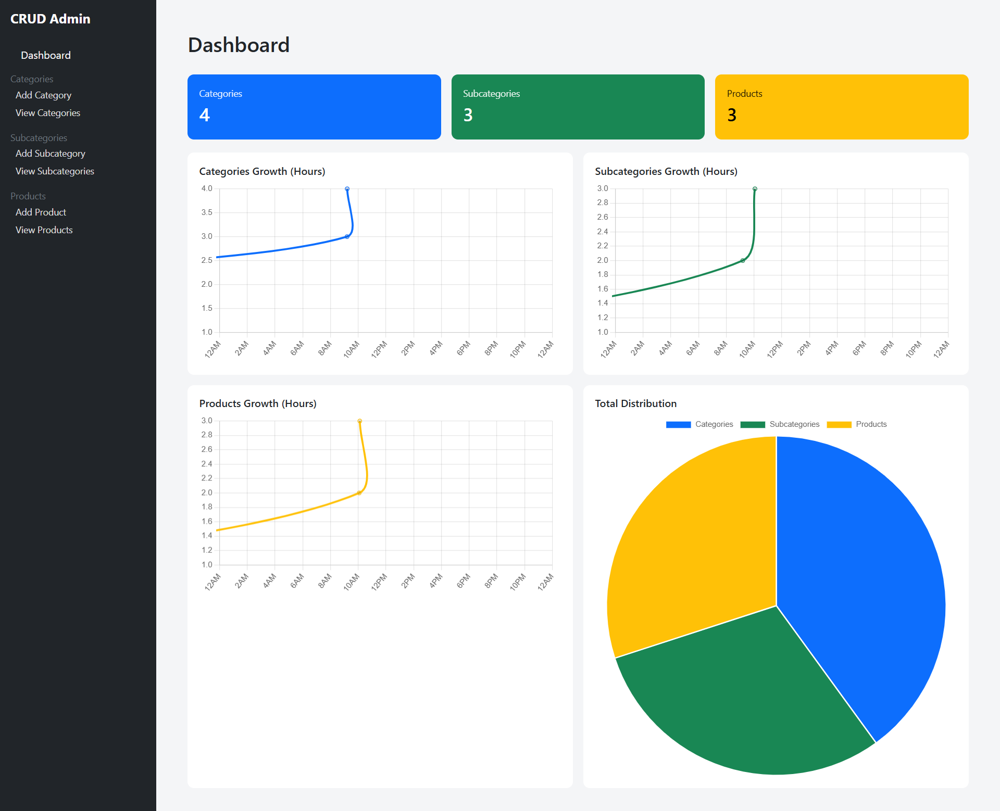
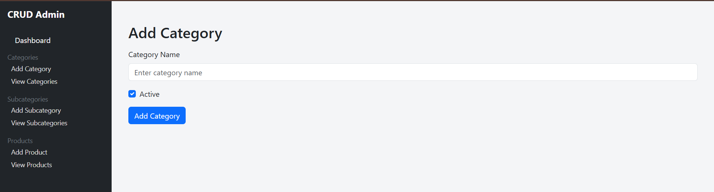
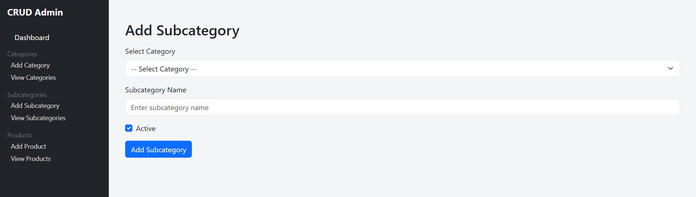
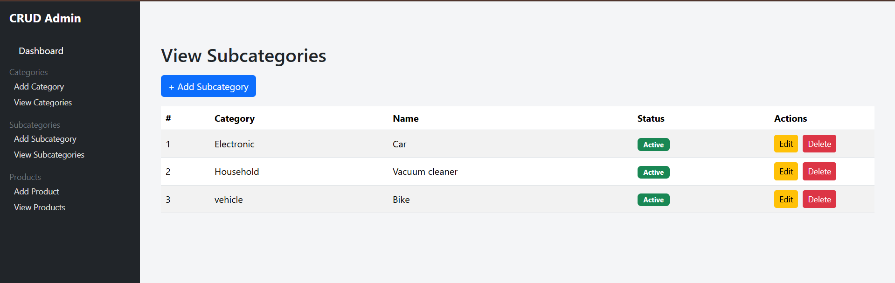
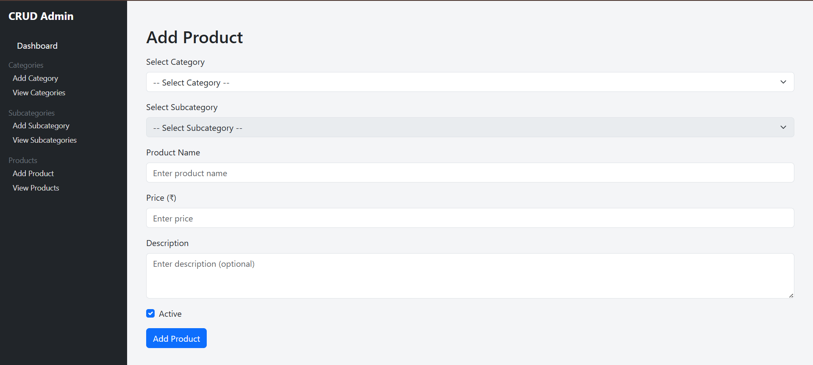
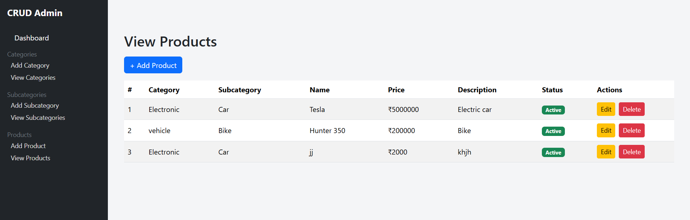
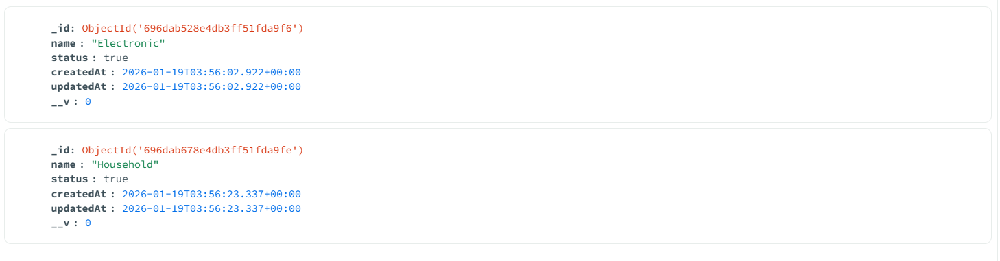
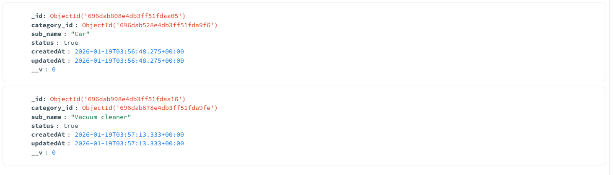
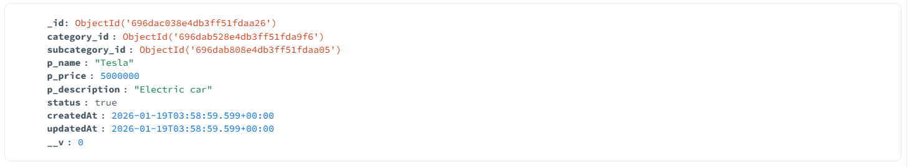

# 🛍️ CRUD Admin Panel (Categories / Subcategories / Products)

A full-stack CRUD admin panel built with **React + Bootstrap + Node.js + MongoDB**, supporting hierarchical product management with a clean admin UI and dashboard analytics.

---

## 🚀 Features

### **Frontend**
✔ Responsive UI (Bootstrap)  
✔ Dashboard with counts  
✔ CRUD for Categories  
✔ CRUD for Subcategories (linked with categories)  
✔ CRUD for Products (linked with category & subcategory)  
✔ Axios-based API communication  
✔ Validation & error feedback  

### **Backend**
✔ Express.js REST API  
✔ MongoDB with Mongoose schemas  
✔ Category → Subcategory → Product relations  
✔ JSON structured responses  
✔ Async/await error handling  

---

## 📸 Frontend Screenshots (7 Pages)

Below are the 7 main UI pages of the frontend interface, along with detailed descriptions of their functionality and purpose.

---

### **1. Dashboard**
The dashboard provides a quick overview of the system. It displays summarized counts of categories, subcategories, and products stored in the database.

---

### **2. Add Category**
Used to create new top-level categories for product grouping.

---

### **3. View Categories**
Displays all categories with options for editing and deletion.

---

### **4. Add Subcategory**
Allows admins to add subcategories under selected parent categories.

---

### **5. View Subcategories**
Shows subcategories with their linked parent categories.

---

### **6. Add Product**
Form to create new products linked to both category and subcategory.

---

### **7. View Products**
Displays a structured list of products linked with category and subcategory.

---

## 🗄 MongoDB Backend Screenshots (3 Images)

---

### **1. Categories Collection**
Stores all parent category records.

---

### **2. Subcategories Collection**
Stores subcategories along with their parent reference.

---

### **3. Products Collection**
Stores product data including category and subcategory references.

---

## 🧱 Tech Stack

| Layer | Technology |
|---|---|
| Frontend | React, Bootstrap, Axios |
| Backend | Node.js, Express.js |
| Database | MongoDB + Mongoose |
| APIs | REST JSON |
| Environment | Node v18+ |

---

## 📂 Project Structure

backend/
 ├── controllers/
 ├── models/
 ├── routes/
 └── server.js

frontend/
 ├── src/
 │   ├── pages/
 │   ├── components/
 │   └── App.js

---

## ⚙️ Setup & Run Locally

### Install dependencies

cd backend
npm install

cd ../frontend
npm install

### Run backend server

cd backend
npm start

### Run frontend app

cd frontend
npm run dev

---

## 🧪 API Endpoints Overview

| Method | Endpoint | Description |
|---|---|---|
| GET | /category | Fetch categories |
| POST | /category | Add category |
| GET | /subcategory | Fetch subcategories |
| POST | /subcategory | Add subcategory |
| GET | /product | Fetch products |
| POST | /product | Add product |

---

